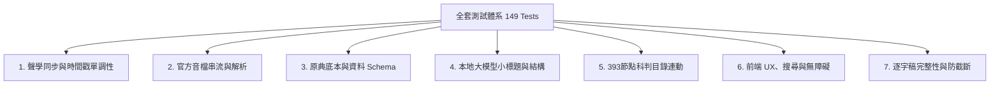

# 🧪 自動化測試套件規範與要求說明 (Testing Specification)

本專案建立了涵蓋 **單元測試（Unit）**、**驗收測試（Acceptance）**、**端到端瀏覽器測試（Browser Smoke）** 與 **聲學盲測（Acoustic Verification）** 的全方位自動化測試體系（共 149 項測試，100% 通過）。

---

## 📋 測試類別與涵蓋要求



---

### 1️⃣ 聲學同步與時間戳嚴謹性測試 (Acoustic & Monotonicity)
* **相關檔案**：`tests/unit/timeAligner.test.js`, `tests/unit/syncPlayer.test.js`, `tests/unit/textSegmenter.test.js`, `tests/acceptance/localModelHeadings.test.js`, `scripts/verify_audio_sync.py`
* **檢驗要求**：
  1. **時間戳嚴格單調遞增**：所有句子必須滿足 $s[i].\text{start} \ge s[i-1].\text{end} - 0.05$ 秒，絕不允許時間軸回溯或倒流。
  2. **二分搜尋效率**：`findSentenceIndexByTime` 需在 $O(\log N)$ 時間複雜度內精確鎖定當前發音句子。
  3. **語音停頓平滑維持**：法師開示停頓（Silence gap）期間，播放器需平滑維持上一句的高亮狀態，不閃爍。
  4. **比例縮放適應（Ratio Scaling）**：當音訊時長與逐字稿有些微時差時，自動計算比例對齊。
  5. **聲學盲測吻合度**：`verify_audio_sync.py` 透過 FFmpeg 隨機截取 15 段音訊並呼叫 ASR 交叉比對，吻合率需 $\ge 75\%$。

---

### 2️⃣ 官方原始音檔解析測試 (Audio Map & Stream Resolution)
* **相關檔案**：`tests/unit/audioMap.test.js`, `tests/unit/resolveAudioUrl.test.js`
* **檢驗要求**：
  1. **198 講全量覆蓋**：`audio_map.json` 必須 100% 包含全書 198 堂課的官方 Flyday 原始 MP3 串流網址。
  2. **解析相容性**：`resolveAudioUrl` 需同時支援相對路徑（`audio/29A.mp3`）與官方遠端 URL（`https://buddha.flyday.com.tw/...`）。
  3. **播放保護**：防止未緩衝的音訊直接 seek 導致播放器卡死或重頭播放。

---

### 3️⃣ 《入中論善顯密意疏》原典底本對齊測試 (Treatise Ground Truth)
* **相關檔案**：`tests/unit/sourceTextGrounding.test.js`, `tests/unit/dataSchema.test.js`
* **檢驗要求**：
  1. **285 頁原典底本存在性**：驗證真值底本（Ground-truth）285 頁論著全文皆存在且內容完整。
  2. **月稱菩薩本頌驗證**：驗證 `all_verses.json` 中收錄的所有偈頌出處與頁碼對照無誤。
  3. **講次頁碼映射**：驗證 `course.json` 中各堂課標註的 `pageRange` 皆能精確對應到真實論著頁面。
  4. **Schema 嚴格性**：驗證所有 `session_*.json` 符合 `sessionId`, `audioUrl`, `lastUpdated`, `paragraphs`, `sentences` 標準格式。

---

### 4️⃣ 本地大模型篇章結構與小標題測試 (Local LLM Structure & Headings)
* **相關檔案**：`tests/acceptance/localModelHeadings.test.js`
* **檢驗要求**：
  1. **主題劃分合理性**：驗證大模型產出 6～10 個符合《善顯密意疏》論義轉折的章節小標題。
  2. **DOM 視覺渲染**：驗證包含標題的段落能正確在網頁中生成 `<h3 class="transcript-heading">`。
  3. **段落 ID 綁定**：小標題需精準綁定至對應的起始段落 ID（如 `p-1`, `p-27` 等）。

---

### 5️⃣ 🌟 29A 黃金標準高階驗收測試 (29A Golden Benchmark Quality Standard)
* **相關檔案**：`tests/acceptance/goldenStandard.test.js`
* **檢驗要求（針對所有已完成轉換之最新講次）**：
  1. **Pattern 1 - 引擎與版本元數據**：驗證包含 `_meta.engine` (Whisper Large-v3)、`_meta.llm_proofread` (Qwen3.8-27B)、`lastUpdated` (YYYY-MM-DD) 以及段落/句子計數完全一致。
  2. **Pattern 2 - 官方廣播級音訊串流**：驗證 `audioUrl` 直連 Flyday 官方原始 MP3 串流。
  3. **Pattern 3 - 主題小標題格式與段落密度**：驗證小標題語法為 `【主題】說明`，且平均段落密度介於 1.5～8.0 句之間。
  4. **Pattern 4 - 禁用同音字與法相純淨度（Negative Patterns）**：硬性斷言絕無「非紋症/肺紋症」、「至向有/自向有」、「損壞羹/更」、「設法心法」、「不先一心法」、「生一地/生意地」、「七狂法/七況法」、「羊眼」等 ASR 語音錯字。
  5. **Pattern 5 - 毫秒級聲學嚴格單調性**：驗證每個句子時間戳 $s[i].\text{start} \ge s[i-1].\text{end} - 0.05$ 秒，完全消除時間軸回溯。

---

### 6️⃣ 全書總科判目錄體系連動測試 (TOC & Navigation)
* **相關檔案**：`tests/unit/toc.test.js`, `tests/cross-artifact-consistency.test.js`
* **檢驗要求**：
  1. **393 個階層節點**：驗證 17 頁完整總科判（甲、乙、丙、丁、戊、己、庚層級）完整載入。
  2. **講次跳轉連動**：點擊科判條目必須正確跳轉至該講次與課本頁碼，絕無死連結（Dead links）。

---

### 6️⃣ 前端 UX、搜尋與無障礙測試 (Search, UX & A11y)
* **相關檔案**：`tests/unit/search.test.js`, `tests/unit/sidebarFilterBehavior.test.js`, `tests/unit/uxCourseOverview.test.js`, `tests/unit/a11y.test.js`, `tests/acceptance/browserSmoke.test.js`
* **檢驗要求**：
  1. **即時文字搜尋**：支援逐字稿內全文搜尋、黃色高亮匹配、`Enter` / `Shift+Enter` 上下跳轉匹配點、`Escape` 清除。
  2. **側邊欄多維過濾**：支援依講次編號（`02A`）、摘要關鍵字（`歸敬頌`）、頁碼（`p.63`）進行模糊過濾。
  3. **無障礙（A11y）防 Tab 陷阱**：實作 Roving Tabindex（僅第一句為 Tab focusable，其餘為 `-1`），防止鍵盤使用者陷入千句 Tab 迴圈。
  4. **瀏覽器端到端正常性**：Console 零致命報錯、所有 JS/CSS/JSON/MP3 資源 Content-Type 正確無誤。

---

### 7️⃣ 逐字稿完整性與防截斷測試 (Completion & Quality)
* **相關檔案**：`tests/acceptance/completion.test.js`, `tests/quality.test.js`, `tests/required-set-not-truncated.test.js`
* **檢驗要求**：
  1. **零內容遺漏**：逐字稿字數需與音訊時長完全匹配，無任何開頭或結尾截斷。
  2. **零大模型殘留雜質**：文字中絕不可包含「好的，這是我為您校對的...」或 Markdown 代碼塊等 Prompt 雜訊。

---

## 🏃 執行全套測試

```bash
npm test
```
* **期望輸出**：`pass 148 / fail 0 / skipped 1 (149 tests total)`
